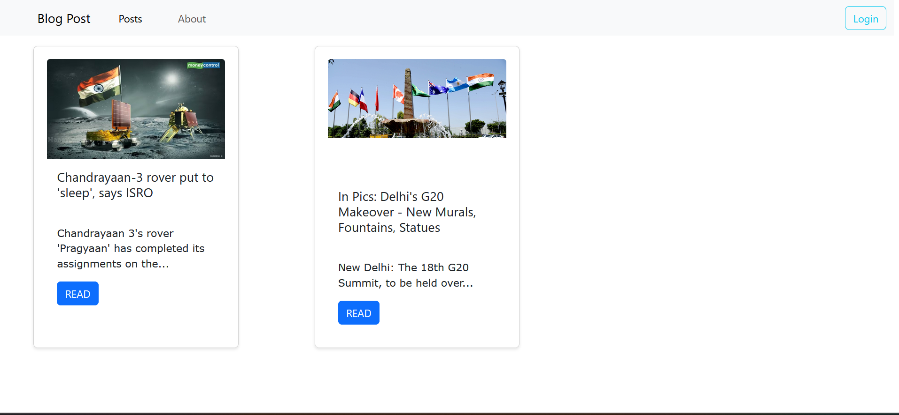
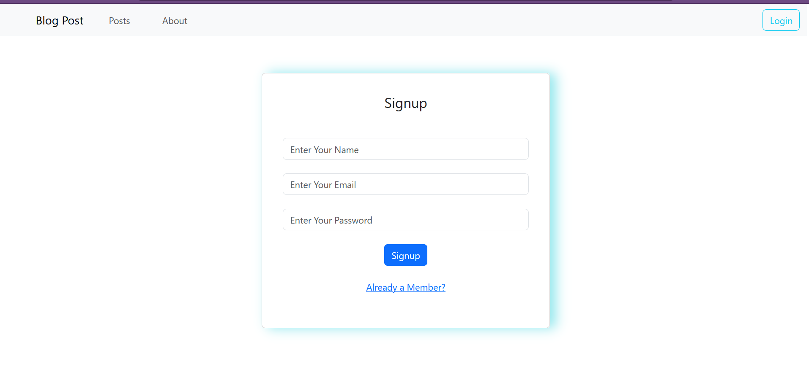
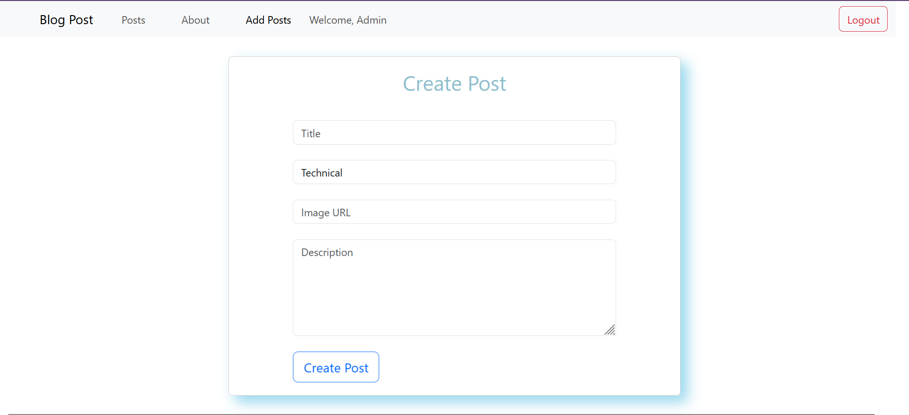
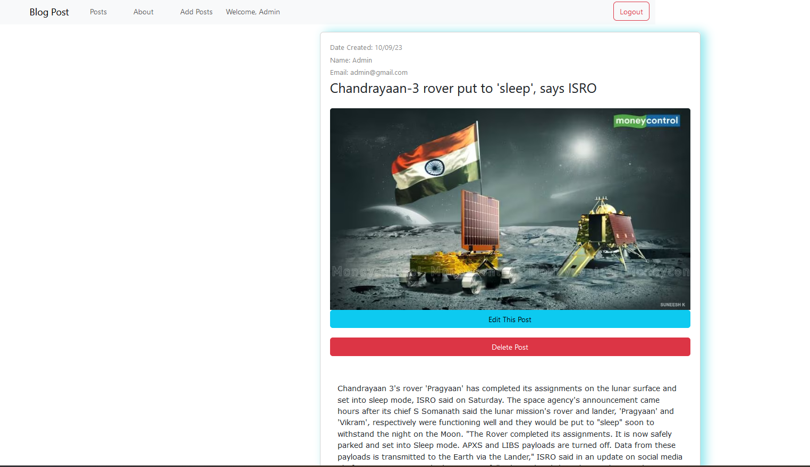

# React Blog Post Application

This is a simple React blog post application where you can create, read, update, and delete blog posts. It uses JSON Server as a mock API for handling blog post data.

## Getting Started

Follow the instructions below to set up and run the application on your local machine.

### Prerequisites

Make sure you have Node.js and npm installed on your machine.

### Installation

1. Clone the repository:

\`\`\`
git clone https://github.com/your-username/react-blog-post.git
cd react-blog-post
\`\`\`

2. Install dependencies:

\`\`\`bash
npm install
\`\`\`

### Running the Application

Start the React development server:

\`\`\`
npm start
\`\`\`

This will launch the application on [http://localhost:3000](http://localhost:3000).

### Setting up the Mock API

To simulate a backend server, we will use JSON Server. Open a new terminal and run the following command:

```bash json-server db.json --port 3010 ```

This will start the JSON Server on [http://localhost:3010](http://localhost:3010) and serve your mock data.

### Default Admin Credentials

- Admin Id: admin@gmail.com
- Password: admin1234

## Screenshots






## Features

- Create, Read, Update, and Delete blog posts.
- User authentication with an admin account.

